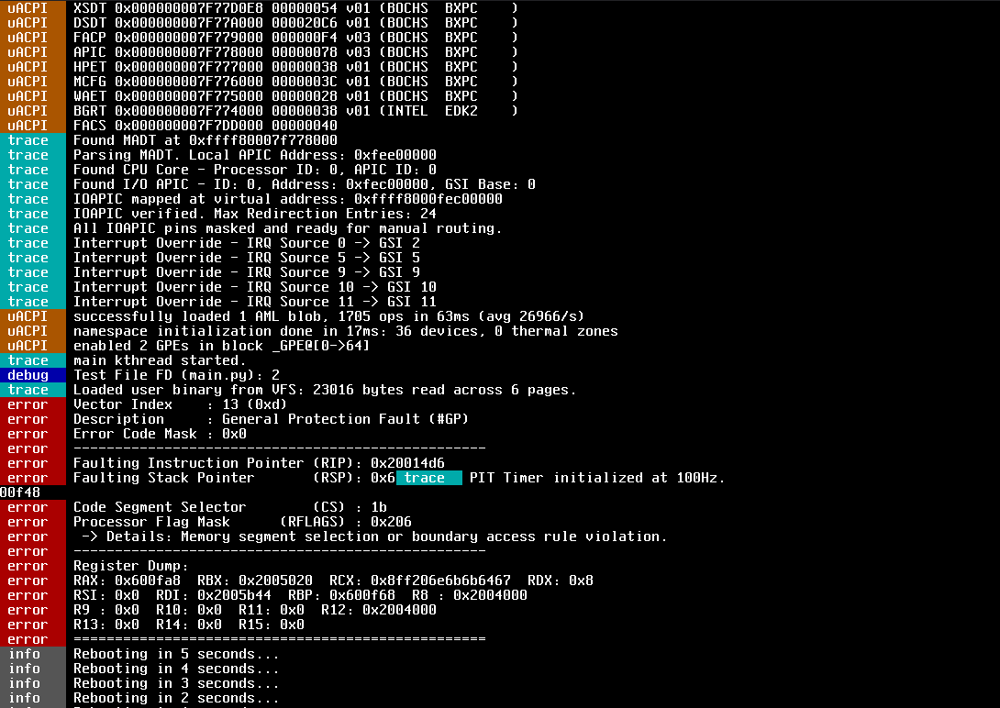

# Libra
Hello my fellow developers. I've started this project as a small kernel. It's a sequel to my previous kernels (unreleased).
It aims to be a stable kernel and efficient. Hence the name Libra, but this kernel is still quite experimental, and we are super far away from this goal. So, it's a pleasure if anyone would like to help with this project.
## Getting Started
### Project Instructions
I've taken inspiration from other kernels and see that this section for devs is mostly unclear.
The actual low-level kernel assembly code for booting isn't there. This kernel boots directly to C using Limine.
If you are unfamiliar with Limine, I'd recommend for you to check it out before developing here.
This is a higher-half kernel. Limine has mapped the pages already, and I'd prefer that we edit and shall not **REPLACE** the memory map.
### Creating a branch
Before submitting your edits. Please create a branch using this format: user_name-YY-MM-DD-v#.#.#-summary_of_your_edit.
And then create a pull request. Within a small period of time it might be accepted by me or not.

### Small Notes

The user Zirconium is also me, just another account, my Git was misconfigured at the time.

### Instructions to build
1. Install the dependencies listed below:
    - A `x86_64-elf` bare metal toolchain
    - `QEMU` (At least system)
    - `make`
    - `nasm`
    - `xorriso`
    - `libncurses-dev`
2. Configure the build
    1. Run `make menuconfig` to configure the kernel
    2. Run `make genconfig` to generate the configuration header
3. Build and Run
    1. Run `make -j8`
    2. Run `make run`
### Cleaning
Run `make clean`
## Feature Status

| Feature | Status | Notes |
|----------|----------|----------|
| PMM | Complete | Bitmap allocator |
| VMM | Complete | Higher-half mapping |
| Scheduler | Complete | Round-robin preemptive |
| uACPI | Complete | Namespace and initialization working |
| PCI | Not Started | |
| SMP | Not Started | |
| Filesystem | Complete | VFS Implemented |
| Userspace | WIP | Crashes on load |
| AHCI | Not Started | |
| PCIe | Not Started | |
| APIC | Complete | Fully working |
| PIT | Complete | Fully working |
| HPET | Not Started | |
| Syscalls | WIP | Complete but userspace doesn't work yet |
| User Security | WIP | Complete but userspace doesn't work yet |
## Release Scheme

- bca / bc# → broken builds (unstable / may not boot)
- nca / nc# → nightly builds (experimental features)
- rca / rc# → release candidates (stabilizing)
- release → stable version

Each major version may contain up to 7 iterations per stage.